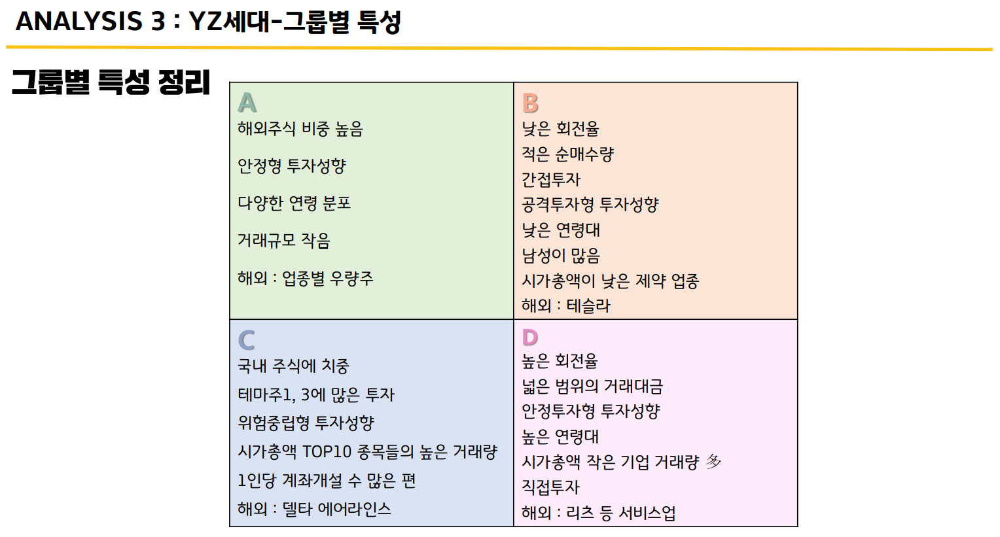
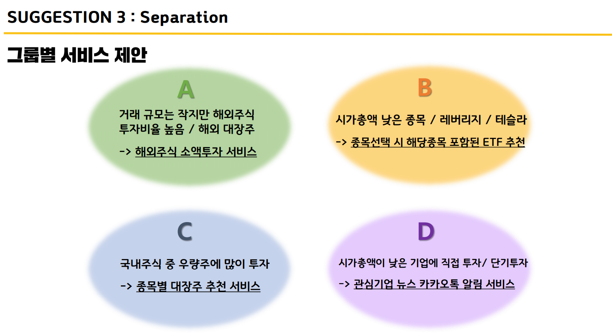

# 💳 NH투자증권 YZ세대 투자자 프로파일링
- [NH투자증권에서 주최한 대회](https://dacon.io/competitions/official/235663/overview/description)로 데이터를 활용한 YZ세대 특징도출과 새로운 아이디어제시

## 🔎격동의 YZ세대, 변동성에서 살아남기
- YZ세대가 주식시장의 진입동기를 살펴봄
  - 기준금리가 연속적으로 하락, 주식 매수량 증가로 이어짐
  - 주가하락, KOSPI지수의 하락과 YZ세대 주식시장 진입기 동일
- YZ세대 특성도출
  - MTS를 활용한 주식거래가 활발함
  - 레버리지상품 투자비율이 다른 세대보다 높음
  - 해외투자 비율이 다른 세대보다 높음
- YZ세대 그룹화
  - 4그룹으로 군집화
  - 그룹별로 특징 도출

### 💡 제안
- UX,UI부분 개선 (한눈에 보는 채권)
- 해외투자비율이 높으므로 해외투자 정보 제공
- 그룹별 서비스 제안
  - 위의 4그룹의 특징을 활용한 서비스 제안
