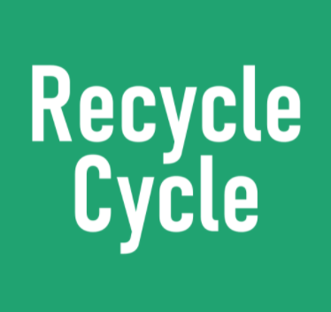
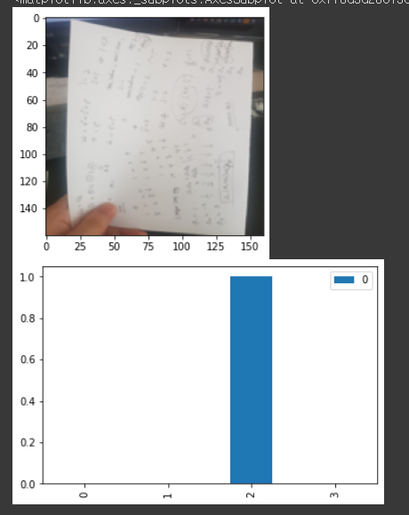
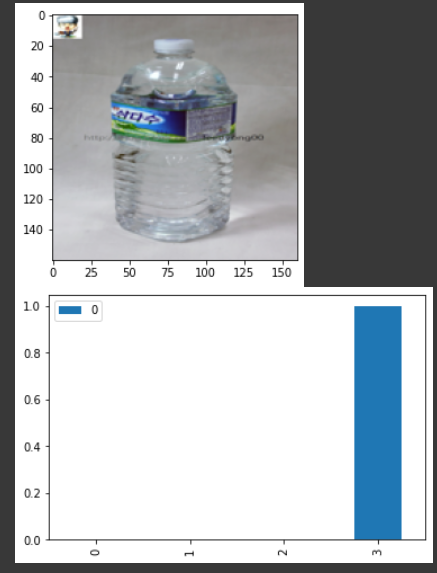
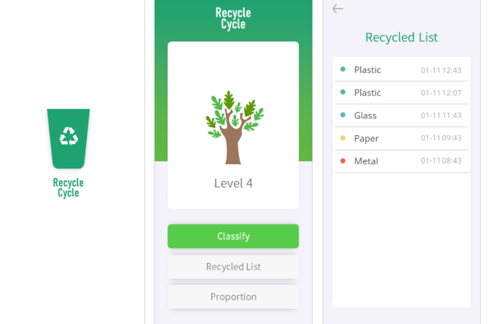
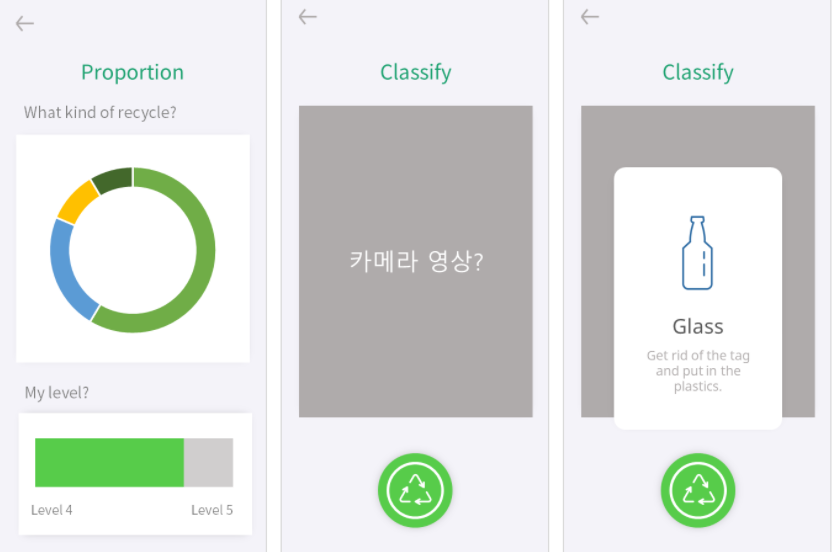

# 💪GDSC SCH 3기 Core Member Project
### ♻Recycle-Cycle
 
레포지토리([Repo Link](https://github.com/Recycle-Cycle/Recycle-Cycle))

프로토타입([Prototype](https://docs.google.com/presentation/d/1vj9ziAh9E7hY3_4KDfkxdO-1WbkcVV0S0qvFkQ86RCA/edit#slide=id.p1))

- "분리수거를 잘하고 환경오염을 줄여보자!"라는 취지로 앱 개발
	- 이미지 인식(ML Team)
	- 앱제작(Flutter Team)
- 카메라 모듈을 이용하여 앱에서 사진을 찍고 그 사진이 어떤 종류의 쓰레기인지 예측(ML) -> 간단한 통계기능과 분리수거를 많이하면 나무가 자라는 것을 구현(Flutter)
### 🧠 ML Part

- 사용모델 : Mobile Net V3([describe model Link](https://www.tensorflow.org/api_docs/python/tf/keras/applications/MobileNetV3Small)) 
   사용데이터 : Recycle_Classification_Dataset([Kaggle](https://www.kaggle.com/jinfree/recycle-classification-dataset))
- Data Set Validation 기준 96%의 정확도 
   class label = 0 : can , 1 : glass , 2 : paper , 3 : plastic

[ML_Prediction Link](https://github.com/0001010/Dacon-Kaggle/blob/main/Recycle-Cycle(gdsc_project)/gdsc_core_toyproject_model_pred.ipynb)
- Issue : Model이 커서 사양이 좋은컴퓨터로 학습후 모델만 따로 불러와서 예측  
  
    
### ♻전체적인 그림
  