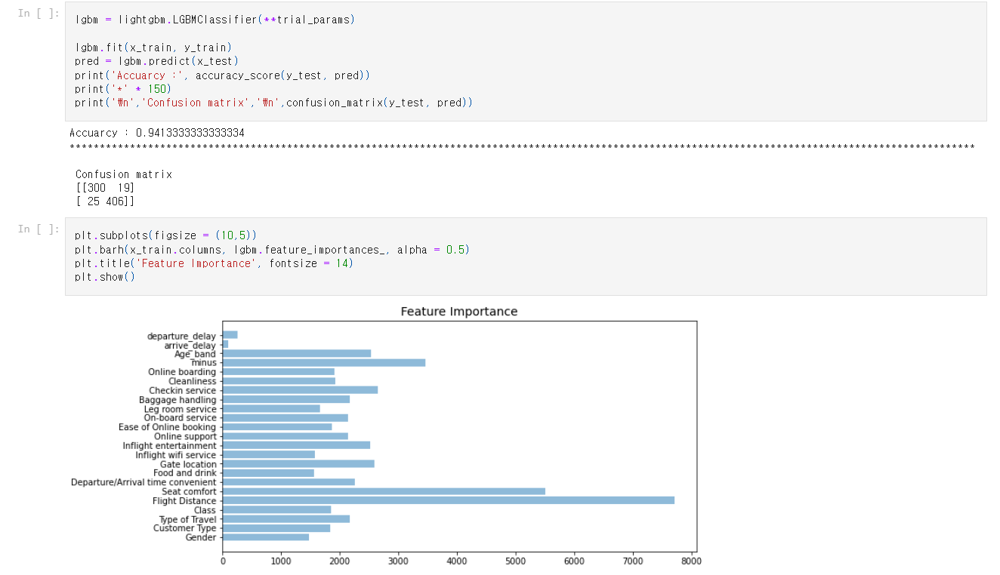

# ✈항공사 고객 만족도 예측(Dacon)
Dacon Competition으로 항공사의 고객 만족도를 예측
	- 평가지표는 Accuracy

[Competition Link](https://dacon.io/competitions/official/235871/overview/description)

### 🔎EDA
약간의 클래스 불균형 존재(1 : 55.6%, 0 : 44.4%)
	- 1과 0의 이진 분류이다.(만족한다, 불만이다)
- 각 변수를 시각화
출발시간과 도착시간을 빼줌(운행시간)
지연시간도 만족도에 영향을 미칠듯 하여 출발 지연, 도착 지연 변수 생성하고 그것의 차이도 변수로 생성

### ⚙ML 모델링
사용한 모델은 LGBM이고 K-Fold K=5기준으로 Accuarcy는 91.95%
Test Data 성능은 93.6%이다.
- 하이퍼 파라메터 튜닝 실시
	- Optuna로 하이퍼 파라메터 조정
	- Test 데이터의 Accuarcy는 94.13%로 하이퍼 파라메터 조정 전보다 성능 향상
  
